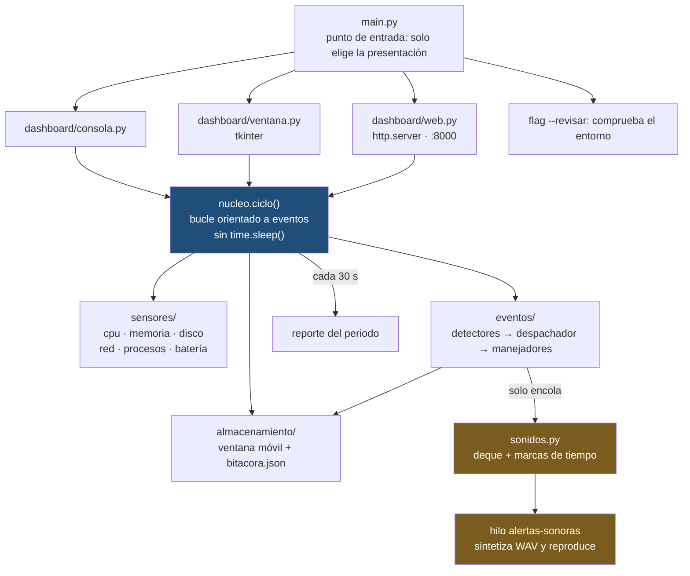
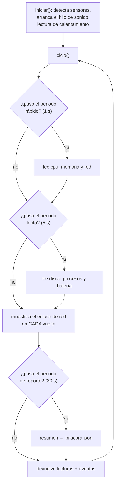
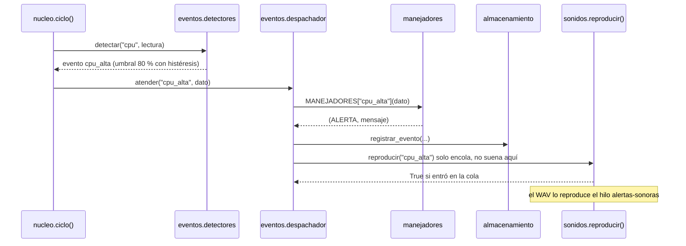
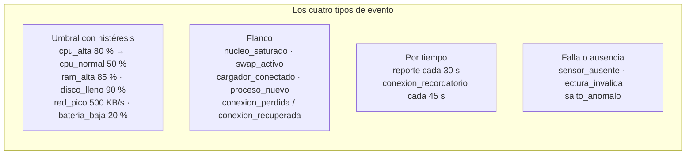
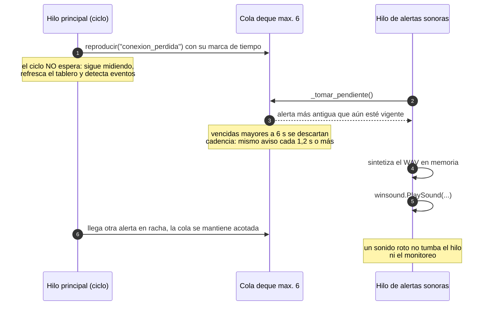

# Laboratorio 1 — DSVIII · Nodo de telemetría con alertas sonoras

Nodo de telemetría de una computadora que mide en tiempo real el uso de la CPU, la
memoria RAM, el disco, la red, los procesos y la batería; detecta condiciones de
alarma; y reacciona con **alertas sonoras que jamás bloquean el ciclo de monitoreo**:
quien detecta solo *encola* (cola `deque` + marcas de tiempo) y quien suena es un
*hilo aparte*.

El mismo motor alimenta tres presentaciones: consola, ventana gráfica (tkinter) y
dashboard web local.

---

## Objetivo

Construir un nodo de telemetría en Python, organizado con **paquetes y módulos** y con
una **arquitectura orientada a eventos**, que:

1. separe responsabilidades: sensores, eventos, almacenamiento y presentación;
2. detecte los cuatro tipos de evento del curso (umbral con histéresis, flanco,
   tiempo y falla/ausencia) sin cadenas de `if/elif`, usando un diccionario
   evento → manejador (el mismo mecanismo de las bibliotecas de eventos y de MQTT);
3. reaccione con un **reproductor de alertas sonoras no bloqueante**, usando cola y
   marcas de tiempo, de modo que mientras suena una alerta el dashboard siga
   refrescando y el ciclo siga detectando eventos;
4. presente la información en tres tableros que comparten el mismo núcleo;
5. guarde lo medido en una ventana móvil y en una bitácora JSON.

---

## Qué hace

| Área | Contenido |
| --- | --- |
| Sensores | `cpu`, `memoria`, `red` (grupo rápido, 1 s), `disco`, `procesos`, `batería` (grupo lento, 5 s) |
| Eventos | 26 eventos conocidos; 21 de ellos tienen patrón sonoro (16 patrones distintos) |
| Reacciones | bitácora `bitacora.json`, colores del tablero, insignia de red, cola de alertas |
| Presentaciones | consola, ventana tkinter, web local en `http://localhost:8000` |
| Sonido | WAV sintetizado en memoria (seno, cuadrada, triangular, barrido, ruido) |
| Pruebas | 41 pruebas unitarias + prueba en vivo con audio real |
| Informe | PDF generado con Arial 12 pt, figuras, tablas y páginas numeradas |

---

## Requisitos e instalación

```bash
git clone https://github.com/KerubeDev/Laboratorio1-DSVIII.git
cd Laboratorio1-DSVIII
pip install -r requirements.txt      # solo psutil==7.2.2
python main.py --revisar             # comprueba psutil, tkinter y sensores
```

* Python 3.11 o superior.
* La batería aparece como `NO disponible` en computadoras de escritorio: es un sensor
  ausente y el programa lo maneja como tal, no es un error.

---

## Uso

```bash
python main.py              # dashboard gráfico (tkinter)
python main.py --consola    # dashboard de texto
python main.py --web        # dashboard en el navegador (http://localhost:8000)
python main.py --revisar    # comprueba el entorno y sale

python generador.py         # carga controlada para provocar eventos (2da ventana)
python pruebas/en_vivo.py   # prueba en vivo con audio real (4 fases)
python generar_informe.py   # genera el informe PDF del laboratorio
```

---

## Arquitectura



### Estructura del proyecto

```
monitor_iot_QuerubeAriza/
├── main.py                  # elige la presentación y arranca
├── nucleo.py                # bucle de monitoreo (sin time.sleep)
├── config.py                # TODOS los umbrales, tiempos y sonidos
├── sonidos.py               # reproductor no bloqueante (deque + hilo)
├── generador.py             # carga controlada para provocar eventos
├── generar_informe.py       # generador del informe PDF
├── requirements.txt
├── sensores/                # cpu memoria disco red procesos bateria
├── eventos/                 # detectores · despachador · manejadores · conexion_red
├── almacenamiento/          # ventana móvil, resumen y bitácora JSON
├── dashboard/               # consola · ventana (tkinter) · web
├── pruebas/                 # 41 pruebas unitarias + en_vivo.py
└── capturas/                # capturas y salidas que alimentan el informe
```

---

## Ciclo de monitoreo

El ciclo no usa `time.sleep()`: cada tarea guarda su propia marca de tiempo y se
lee cuando le toca. Un mismo bucle atiende tareas con periodos distintos sin
bloquearse, y puede llamarse cada 200 ms desde cualquier tablero.



---

## Detección de eventos

**Separación de responsabilidades:** `detectores.py` decide *si* ocurrió (mira los
números), `manejadores.py` decide *qué hacer* (reacciona) y `despachador.py` los
conecta con un diccionario. Se puede cambiar la reacción sin tocar la detección, y
viceversa.





---

## Alertas sonoras que no bloquean el ciclo

> Regla del laboratorio: mientras suena una alerta, el dashboard debe seguir
> refrescando y el ciclo debe seguir detectando.

Para eso se separan dos responsabilidades: **quien detecta solo encola** y **quien
suena es un hilo que ya está creado**.



### Controles por marca de tiempo

| Control | Constante | Valor | Para qué sirve |
| --- | --- | --- | --- |
| Cadencia | `SONIDO_COOLDOWN` | 1,2 s | no repetir el mismo aviso antes de tiempo |
| Vencimiento | `SONIDO_VENCIDO` | 6,0 s | descartar alertas que ya no tienen sentido |
| Cola acotada | `SONIDO_MAX_COLA` | 6 | que una racha no inunde la cola |
| Pausa del hilo | `SONIDO_PAUSA` | 0,05 s | espera del hilo con la cola vacía |

Además: volumen maestro 0,30, fundido anti-clic de 8 ms, límites auditivos
85–4000 Hz, y backends `winsound` (Windows), `campana` (respaldo) o `nulo` (pruebas).

### Eventos y sus sonidos

| Evento | Patrón | Qué se oye |
| --- | --- | --- |
| `conexion_perdida` | `sirena_caida` | barrido descendente 880→160 Hz |
| `conexion_recordatorio` | `latido_caida` | latido grave repetido (cada 45 s) |
| `conexion_recuperada` | `arreglo_ascendente` | arreglo do-mi-sol-do |
| `cpu_alta` | `doble_tic` | dos tics agudos, tipo semáforo |
| `nucleo_saturado` | `tic_nucleo` | doble tic medio |
| `ram_alta` | `acorde_memoria` | tres notas y se queda tensa |
| `disco_lleno` | `golpe_grave` | golpe seco y grave |
| `red_pico` | `swoosh_subida` | barrido hacia arriba |
| `bateria_baja` | `pip_bateria` | tres pitidos lentos |
| `cargador_desconectado` | `plano_descarga` | el tono se va al piso |
| `sensor_ausente` | `zumbido_falla` | zumbido con ruido |
| `lectura_invalida` | `tictac_invalido` | tres tics nerviosos |
| `salto_anomalo` | `zigzag_salto` | ida y vuelta brusca |
| `proceso_pesado` | `grunido_proceso` | gruñido cuadrado grave |
| `swap_activo` | `pulso_swap` | pulso binario |
| `cpu_normal`, `ram_normal`, `red_calma`, `disco_aliviado`, `cargador_conectado` | `chime_corto` | campanita de alivio |
| `bateria_recuperada` | `arreglo_ascendente` | arreglo ascendente |

Todos los patrones, umbrales y tiempos viven en `config.py`: ningún otro archivo del
proyecto define números de sonidos ni de tiempos.

---

## Pruebas

```bash
python -m unittest discover -s pruebas -t . -v
```

| Archivo | Pruebas | Qué cubre |
| --- | --- | --- |
| `pruebas/test_sonidos.py` | 14 | cola, cadencia, vencimiento, síntesis, patrones |
| `pruebas/test_conexion_red.py` | 13 | flancos, recordatorio, interfaces ignoradas |
| `pruebas/test_integracion.py` | 9 | el ciclo completo con su reacción sonora |
| `pruebas/test_ventana.py` | 5 | refresco e insignias de la ventana tkinter |
| **Total** | **41** | resultado esperado: `Ran 41 tests ... OK` |

Prueba en vivo con audio real (4 fases: reconocimiento auditivo, no bloquea,
cadencia/vencimiento y veredicto):

```bash
python pruebas/en_vivo.py
```

---

## Informe PDF

```bash
pip install reportlab pillow
python generar_informe.py
```

Genera `Informe_Nodo_Telemetria_Querube_Ariza.pdf`: tipografía Arial 12 pt, índice
automático, páginas numeradas (`Página N de M`), 14 figuras numeradas con
descripción y 4 tablas (alertas sonoras y sus justificaciones, controles del
reproductor y suites de pruebas). Las capturas que alimentan el informe viven en
`capturas/`, dentro del repositorio.

---

## Configuración

Todo lo ajustable está en `config.py`, agrupado por bloques:

* identificación del nodo (`NODO`, `UBICACION`);
* periodos: rápido 1 s, lento 5 s, reporte 30 s, refresco 200 ms;
* umbrales con histéresis (CPU 80/50, RAM 85/75, disco 90/85, red 500/200 KB/s,
  batería 20/30 %, proceso pesado 50 %, salto anómalo 40);
* ventana móvil (10 muestras) y bitácora (`bitacora.json`);
* bloque completo del laboratorio: sonido, patrones, eventos y pruebas.

---

## Autoría

Laboratorio 1 · Unidad 2 — Programación en Python para sistemas IoT ·
Facultad de Ingeniería de Sistemas Computacionales — Universidad Tecnológica de Panamá.
Querube Ariza.
